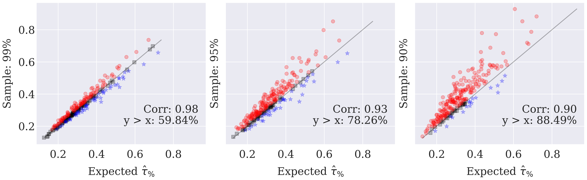

To answer this question, we primarily showcase results for volleyball competitions. The findings should extrapolate to other sports as well.

We conducted the expected turning point methodology for three levels of missing data in all volleyball tournaments: 1%, 5%, and 10%. The graph below illustrates these scenarios (y-axis) compared to the expected turning point with no missing data (x-axis). Although the removal of data may marginally decrease the balance of some tournaments (indicated by blue stars below the equality line), there's a pronounced trend toward tournaments appearing more balanced with less data (depicted by red circles above the line). Since the expected turning point is typically small when the top and bottom teams quickly differentiate themselves from the average ones in the standings, we posit that the absence of matches involving these top and bottom teams could delay this differentiation and, consequently, the turning point. 

The code for this is in `src/paper_review_results.ipynb`.
