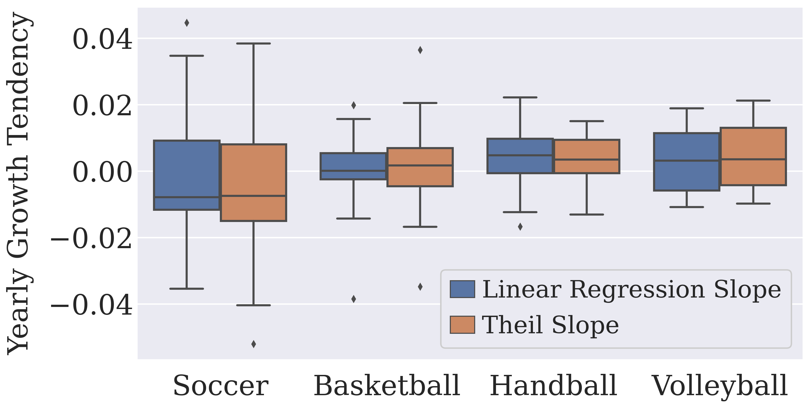

In the boxplot below, we depict the expected turning point slope (indicating the increase or decrease tendency per year) for all tournaments comprising at least eight seasons. The graph demonstrates a strong agreement between the linear regression slope and the Theil-Sen slope (the median slope of all lines through pairs of points). Our analysis reveals a trend towards decreasing balance in soccer tournaments (as evidenced by a negative median tendency) and increasing balance in all other sports (as indicated by a positive median tendency).

This outcome is somewhat expected since soccer tournaments are generally perceived as more balanced compared to others, making a general increase in balance less likely. However, the slopes for soccer tournaments also exhibit greater fluctuations, with some increases or decreases reaching up to 3% annually. This tendency holds significance, as a consistent linear increase of 3% over ten seasons represents a substantial shift in the expected turning point, from occurring after 30% of the season in 2011 to 60% in 2020—a significant enhancement in perceived competitive balance.

Furthermore, our specific analysis of the most renowned leagues suggests a slight positive tendency (between 0.5% and 1%) towards increasing competitive balance for the NBA, Bundesliga (handball/Germany), and La Liga (soccer/Spain). In contrast, the remaining Big Five soccer leagues and volleyball's superleagues (in Russia and Italy) demonstrate a stronger inclination towards decreasing balance, with slopes typically exceeding 1%, and even reaching 2% in the Italian volleyball league.

The code for this is in `src/paper_review_results.ipynb`.

The full table, containing the tendencies of all tournaments for which the slope fit was sucessfull, is available at `./tendency.html`.