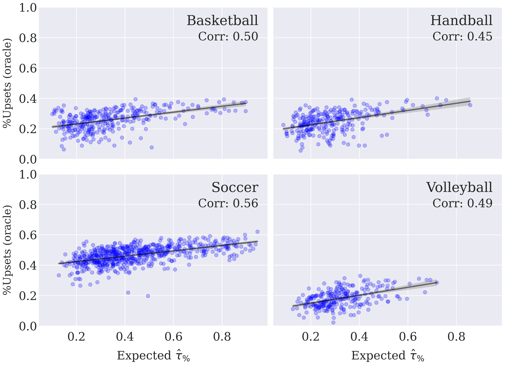

In the scatter plot below, we present an alternative approach to the correlation between our expected coefficient and the betting market accuracy (Figure 4). Rather than predicting the winner from their odds, we apply an oracle approach, i.e., we consider the team with the higher final ranking as the most likely winner. The results are remarkably similar, highlighting the tendency of balanced tournaments to have a higher proportion of upsets.

While we acknowledge that these results are biased given the use of future information to predict the most probable winner, it's important to note that the oracle methodology is not inherently superior. Specifically, this approach is less sensible than betting odds in accounting for events that could impact a team's skills immediately before a match. For instance, if a crucial player on a team is unable to participate in a game, the odds should adjust accordingly. In contrast, the final standings would not be as significantly affected by such events.

The code for this is in `src/paper_review_results.ipynb`.